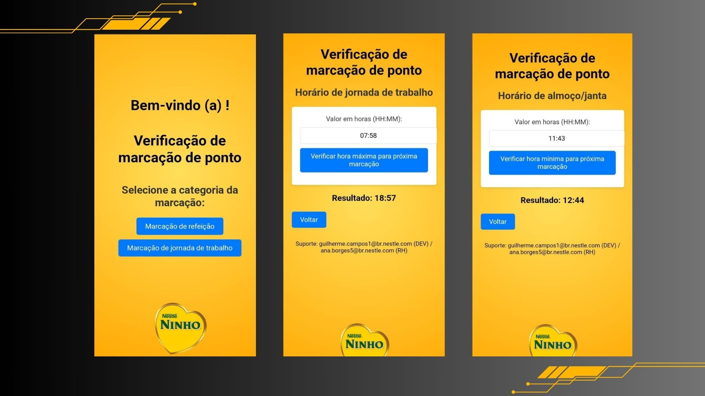

<h1 align=center> Verificação de marcação de ponto </h1>

<div style="display:inline; list-style: none;" align="center">
   <a href="#-Projeto">💻 Projeto</a>
    <a href="#-Recursos">✔️ Recursos</a>
    <a href="#-Como-executar-o-projeto">🚀 Como executar o projeto</a>
    <a href="#-Pré-requisitos">📑 Pré-requisitos</a>
    <a href="#-Tecnologias">🌐 Tecnologias</a>
</div>



## **💻 Projeto**

É um site criado para verificação de qual será a próxima hora para o colaborador(a) realizar o resgitro de marcação de ponto no sistema, com o intuito de seguir as regras compliance da empresa.

## **✔️ Recursos**
* [X] Tela inicial interativa;
* [X] Botões para recursos diferentes;
* [X] Transição de tela com efeito;
* [X] Cálculo de proxima marcação de acordo com a hora fornecida no campo.


## **🚀 Como executar o projeto**
```bash


# Clique no arquivo index.html para abrir

# PRONTO!
```

### **📑 Pré-requisitos**
1. Tenha o Git instalado no seu S.O


## **🌐 Tecnologias**

- Html 
- Css 
- JavaScript
- Git e Github
- Figma


